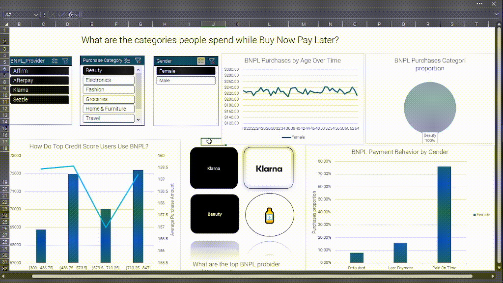

---

# 💳 Análisis de Buy Now Pay Later (BNPL)

  

> Dashboard interactivo para analizar el comportamiento de compra usando servicios Buy Now Pay Later.

---

## 📊 Descripción del Proyecto

Este proyecto analiza:

* ¿En qué categorías gastan las personas usando BNPL?
* ¿Cómo usan BNPL los usuarios con mejor credit score?
* Principales proveedores BNPL y categorías
* Compras BNPL por edad a lo largo del tiempo
* Proporción de categorías de compra
* Comportamiento de pago por género

---

## 🛠 Herramientas Utilizadas

* Excel
* Power Query
* DAX
* Power Pivot
* Tablas dinámicas

---

## 🔎 Análisis Realizado

* Cálculo de **cuartiles del credit score**
* Comparación entre:

  * Ingreso anual
  * Monto de compra BNPL
* Análisis por edad y género
* Uso de iconos de proveedores:

  * Afterpay
  * Sezzle
  * Affirm
  * Klarna

---

## 📈 Preguntas Respondidas

* ¿En qué categorías se gasta más usando BNPL?
* ¿Cómo se comportan los usuarios con mayor puntaje crediticio?
* ¿Cuáles son los principales proveedores y categorías?
* ¿Cómo evolucionan las compras BNPL según la edad?
* ¿Cuál es la proporción de gasto por categoría?
* ¿Cómo varía el comportamiento de pago según el género?

---

## 🚀 Insights

* Usuarios con mayor credit score presentan patrones de gasto distintos.
* El ingreso anual influye en el monto de compra BNPL.
* Algunas categorías dominan el uso de BNPL.
* Existen diferencias claras por edad y género en el comportamiento de pago.

---
